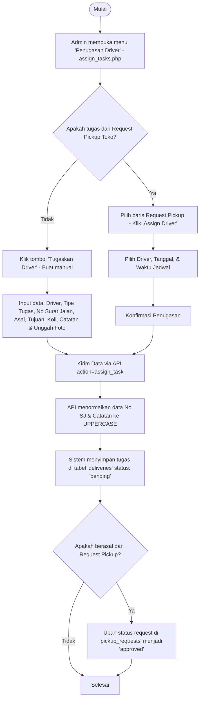

# Dokumentasi Modul: Penugasan Driver WH Operation (`assign_tasks.php`)

Modul ini digunakan oleh Admin atau staf operasional Warehouse untuk menunjuk driver internal, menjadwalkan rute pengiriman (Delivery/Pickup), dan memantau status tugas pengiriman internal.

---

## 1. Diagram Alur Kerja

---

## 2. Fitur Utama Halaman
* **Tugaskan Driver (Add Task Modal)**: Formulir manual untuk menetapkan tugas baru (Delivery/Pickup).
* **Edit Penugasan (Edit Task Modal)**: Memungkinkan admin mengedit keseluruhan rute, tanggal, driver, Surat Jalan, koli, dan catatan jika status belum selesai (`completed`).
* **Quick Edit (Edit Cepat per Kolom)**: Fitur inline di tabel utama. Mengklik cell tertentu (seperti kolom driver atau kolom SJ) akan memunculkan pop-up kecil untuk mengubah data kolom tersebut secara instan tanpa memuat modal edit penuh.
* **Bulk Assign**: Memilih beberapa pengajuan toko secara massal untuk ditugaskan ke driver yang sama.
* **Standardisasi Huruf**: Semua input berupa **No Surat Jalan** dan **Catatan** secara otomatis dipaksa menjadi **HURUF BESAR (UPPERCASE)** baik di antarmuka input maupun saat disimpan di database.

---

## 3. Integrasi API
Halaman ini berkomunikasi dengan `api.php` melalui aksi-aksi berikut:
* `api.php?action=get_drivers`: Mengambil list driver aktif untuk dropdown filter dan dropdown penunjukan.
* `api.php?action=get_locations`: Mengambil list lokasi asal dan tujuan untuk sistem pencarian dropdown otomatis.
* `api.php?action=assign_task` (`POST`): Menyimpan data penugasan baru.
* `api.php?action=edit_delivery` (`POST`): Menyimpan perubahan detail tugas dari modal edit.
* `api.php?action=quick_edit_delivery` (`POST`): Menyimpan perubahan edit cepat (misal, merubah No Surat Jalan di kolom SJ/Koli).
* `api.php?action=delete_delivery` (`POST`): Menghapus penugasan tertentu.
