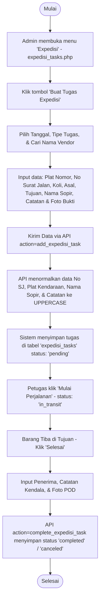

# Dokumentasi Modul: Tugas Ekspedisi Pihak Ketiga (`expedisi_tasks.php`)

Modul ini digunakan oleh Admin untuk menjadwalkan, mencatat, dan memantau tugas pengiriman yang diserahkan kepada pihak ekspedisi eksternal (vendor luar/pihak ketiga).

---

## 1. Diagram Alur Kerja

---

## 2. Fitur Utama Halaman
* **Buat Tugas Ekspedisi (Add Modal)**: Menginput data pengiriman pihak ketiga dengan pencarian otomatis master vendor luar.
* **Mulai Tugas**: Mengubah status pengiriman dari `pending` ke `in_transit` secara manual oleh petugas admin/operasional.
* **Selesaikan Pengiriman (Finish Modal)**: Digunakan untuk memproses tanda selesai saat ekspedisi tiba di tujuan. Admin akan memasukkan nama penerima, catatan pengiriman dari sopir, dan mengunggah berkas foto POD (bukti penerimaan).
* **Batal / Laporan Kendala**: Jika dalam perjalanan ekspedisi eksternal mengalami kendala fatal, status dapat diselesaikan sebagai `canceled` (batal) dengan menginput detail kendala sebagai laporan audit.
* **Standardisasi UPPERCASE**: Untuk menjaga keseragaman data pihak luar, input berupa **Nomor Plat Kendaraan**, **No Surat Jalan**, **Nama Sopir / Driver**, dan **Catatan** secara otomatis dipaksa menjadi **HURUF BESAR (UPPERCASE)** saat disimpan di database.

---

## 3. Integrasi API
Halaman ini berkomunikasi dengan `api.php` melalui aksi-aksi berikut:
* `api.php?action=get_expedisi_vendors`: Memuat list vendor ekspedisi untuk pencarian otomatis dan dropdown filter.
* `api.php?action=get_locations`: Memuat list nama lokasi master (Asal & Tujuan).
* `api.php?action=get_expedisi_tasks`: Mengambil semua daftar penugasan ekspedisi aktif dan riwayat dengan berbagai filter.
* `api.php?action=add_expedisi_task` (`POST`): Menyimpan data tugas ekspedisi pihak ketiga baru.
* `api.php?action=start_expedisi_task` (`POST`): Mengubah status menjadi jalan (`in_transit`).
* `api.php?action=complete_expedisi_task` (`POST`): Menyimpan POD dan mengakhiri pengiriman dengan status `completed` atau `canceled`.
* `api.php?action=delete_expedisi_task` (`POST`): Menghapus tugas ekspedisi dari database.
