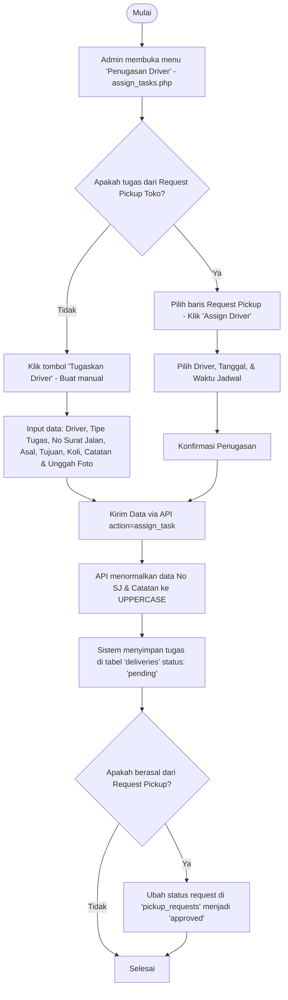
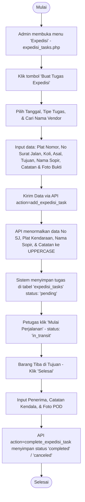
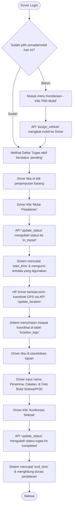
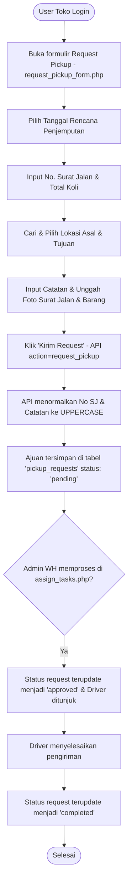

# Dokumentasi Alur Kerja (Flow Documentation) - TMS WH Operation

Dokumen ini menjelaskan alur kerja (workflow) utama di dalam sistem pelacakan pengiriman (TMS), mencakup pembagian alur tugas internal, tugas ekspedisi vendor luar, penggunaan aplikasi mobile oleh driver (`driver.php`), serta alur pengajuan permintaan jemput barang oleh toko (`request_pickup_form.php`).

---

## Daftar Isi
1. [Alur Penugasan Driver Internal (WH Operation)](#1-alur-penugasan-driver-internal-wh-operation)
2. [Alur Penugasan Ekspedisi Pihak Ketiga (Expedisi Task Flow)](#2-alur-penugasan-ekspedisi-pihak-ketiga-expedisi-task-flow)
3. [Alur Penggunaan Aplikasi Driver (`driver.php`)](#3-alur-penggunaan-aplikasi-driver-driverphp)
4. [Alur Permintaan Penjemputan Toko (`request_pickup_form.php`)](#4-alur-permintaan-penjemputan-toko-request_pickup_formphp)

---

## 1. Alur Penugasan Driver Internal (WH Operation)

Alur ini menjelaskan bagaimana Admin atau staf operasional Warehouse membuat tugas pengiriman, menugaskannya ke driver internal, dan mengelola data sebelum pengiriman dimulai.

### Diagram Alur Penugasan Internal (Mermaid Diagram)

### Penjelasan Langkah-Langkah:
1. **Pembuatan Tugas**: Admin menggunakan halaman `assign_tasks.php`. Admin bisa membuat tugas baru secara mandiri (manual) atau menyetujui ajuan pickup dari toko.
2. **Standardisasi UPPERCASE**: Saat admin menyimpan formulir, sistem (baik front-end maupun API `api.php?action=assign_task` / `api.php?action=edit_delivery` / `api.php?action=quick_edit_delivery`) akan menormalkan input **No Surat Jalan** dan **Catatan** secara otomatis menjadi **HURUF BESAR (UPPERCASE)**.
3. **Penyimpanan**: Tugas disimpan dalam tabel `deliveries` dengan status awal `pending` (menunggu pengerjaan driver). Jika berasal dari pengajuan toko, status ajuan di tabel `pickup_requests` otomatis terupdate menjadi `approved`.

---

## 2. Alur Penugasan Ekspedisi Pihak Ketiga (Expedisi Task Flow)

Alur ini menjelaskan pembuatan tugas ekspedisi yang ditujukan untuk vendor pihak ketiga (eksternal/luar), pencatatan vendor, plat nomor, sopir, serta penyelesaian tugas oleh admin/petugas.

### Diagram Alur Ekspedisi (Mermaid Diagram)

### Penjelasan Langkah-Langkah:
1. **Pembuatan Tugas Ekspedisi**: Admin menginput detail pengiriman di `expedisi_tasks.php`. Nama vendor ditarik secara real-time dari data master vendor ekspedisi (`expedisi_vendors`).
2. **Standardisasi UPPERCASE**: Formulir dan backend API `api.php?action=add_expedisi_task` akan memaksa input **No Surat Jalan**, **Plat Nomor Kendaraan**, **Nama Sopir / Driver**, dan **Catatan** menjadi **HURUF BESAR (UPPERCASE)** untuk menghindari kesalahan ketik data vendor luar.
3. **Pengerjaan & Penyelesaian**:
   - Status diubah menjadi `in_transit` saat tombol **Play** (Mulai) ditekan.
   - Pengiriman diselesaikan secara manual oleh petugas admin di web dengan mengklik tombol **Check** (Selesai) lalu menginput nama penerima barang, catatan driver, dan foto bukti selesai (POD) (`api.php?action=complete_expedisi_task`).

---

## 3. Alur Penggunaan Aplikasi Driver (`driver.php`)

Halaman `driver.php` adalah halaman aplikasi web/mobile responsif yang digunakan langsung oleh driver internal di smartphone mereka untuk menerima tugas, melacak perjalanan GPS, dan mengunggah bukti penerimaan (POD).

### Diagram Alur Aplikasi Driver (Mermaid Diagram)

### Penjelasan Langkah-Langkah:
1. **Klaim Kendaraan**: Driver wajib memilih armada yang dikemudikan hari itu melalui tombol **Pilih Mobil** (`api.php?action=assign_vehicle`) demi keakuratan data kendaraan pada pengiriman.
2. **Pengerjaan & Pelacakan Live GPS**:
   - Driver menekan **Mulai Perjalanan** untuk mengubah status tugas menjadi `in_transit`.
   - Latar belakang browser HP driver secara otomatis melakukan pelacakan GPS setiap 30 detik (`api.php?action=update_location`), mengirim koordinat lokasi driver saat ini ke database yang kemudian ditampilkan di dashboard peta live milik admin (`monitor_live.php`).
3. **Penyelesaian Tugas (POD)**:
   - Driver memasukkan nama penerima, catatan pengiriman, dan mengunggah foto bukti tanda tangan/Surat Jalan yang telah stempel.
   - Menekan **Selesai** mengubah status ke `completed` dan mencatat selisih waktu (`duration`).

---

## 4. Alur Permintaan Penjemputan Toko (`request_pickup_form.php`)

Halaman `request_pickup_form.php` digunakan oleh staf toko / store untuk meminta operasional warehouse menjemput barang/koli (misal: barang retur, transfer barang antartoko).

### Diagram Alur Request Pickup (Mermaid Diagram)

### Penjelasan Langkah-Langkah:
1. **Pengisian Formulir**: Staf toko menginput rencana tanggal jemput, nomor Surat Jalan, jumlah koli, lokasi asal-tujuan, catatan, serta mengunggah foto fisik surat jalan dan barang.
2. **Penyimpanan Status `pending`**: Request dikirim ke `api.php?action=request_pickup`. Data disimpan ke tabel `pickup_requests` dengan status awal `pending`. Input Surat Jalan dan Catatan di-convert ke **UPPERCASE**.
3. **Pemberian Tugas (Approval)**:
   - Request ini muncul di dashboard admin `assign_tasks.php`.
   - Saat admin menunjuk driver (assign driver), status request otomatis berubah menjadi `approved` (disetujui) dan dibuatkan baris tugas pengiriman di tabel `deliveries`.
   - Begitu driver menyelesaikan pengiriman, status ajuan pickup toko tersebut otomatis berubah menjadi `completed` (selesai).
