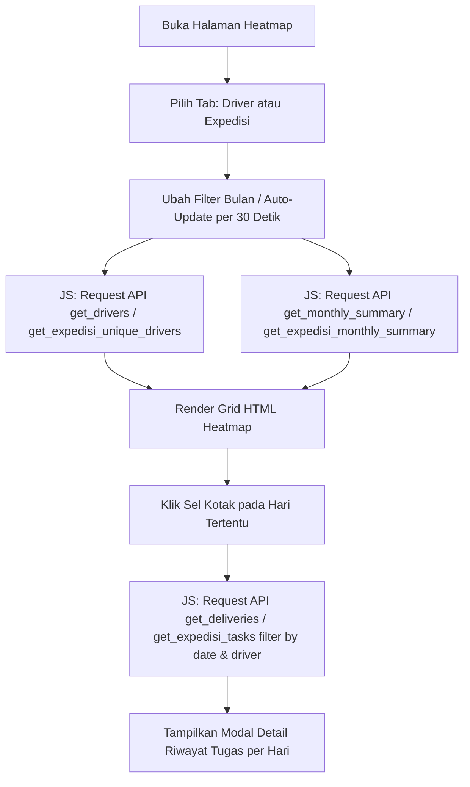

# Dokumentasi: `performance_heatmap.php`

## Deskripsi Singkat
File `performance_heatmap.php` menyediakan visualisasi *Time Line* (Heatmap) untuk memonitor aktivitas pengiriman harian dari para Sopir (*Driver WH*) maupun Vendor (*Expedisi*). Tampilan ini memudahkan Admin/Manajemen untuk melihat secara singkat dan jelas siapa yang aktif bekerja, beban tugas harian per orang, serta persentase penyelesaian tugas pada hari-hari tertentu dalam rentang satu bulan penuh.

## Fitur Utama
1. **Tampilan Kalender Matrix (Heatmap):** Kolom pertama berisi nama sopir/vendor (bersifat *sticky*), diikuti oleh deretan tanggal (1 - 28/31) pada bulan yang dipilih.
2. **Tab Navigasi (Driver vs Expedisi):** Memisahkan tampilan data antara sopir internal gudang (*WH Operation*) dan vendor eksternal (*Expedisi*).
3. **Indikator Warna Status:** 
   - **Kotak Hijau:** Semua tugas di hari tersebut selesai 100%.
   - **Kotak Biru:** Sebagian tugas sudah selesai (masih ada yang berstatus *pending* / *transit*).
   - **Kotak Kuning:** Seluruh tugas masih berstatus belum selesai.
   - **Titik Merah (*Late Marker*):** Menandakan adanya pembatalan tugas (*canceled*) di hari tersebut.
   - **Kolom Merah Muda:** Penanda visual khusus untuk Hari Minggu.
   - **Kolom Hijau Muda:** Penanda visual khusus untuk hari ini (H-0).
4. **Filter Bulan & Auto-Update:** Memungkinkan perpindahan data riwayat antar bulan dengan mudah (via `<input type="month">`). Halaman juga me-*refresh* data melalui AJAX setiap 30 detik tanpa me-muat ulang seluruh halaman (*page reload*).
5. **Modal Detail Harian:** Apabila salah satu sel (kotak angka) pada kalender diklik, sebuah modal (jendela pop-up) akan terbuka untuk merinci tugas spesifik apa saja yang ditangani oleh sopir/vendor tersebut di tanggal yang diklik (termasuk status per tugas, titik asal-tujuan, penerima, dan catatan).

## Alur Data & Interaksi

## API Endpoint yang Terhubung
- **`?action=get_drivers` & `?action=get_expedisi_unique_drivers`**: Digunakan untuk memuat daftar Sumbu-Y (Nama-nama sopir atau nama vendor ekspedisi).
- **`?action=get_monthly_summary` & `?action=get_expedisi_monthly_summary`**: Endpoint krusial yang mengembalikan agregat statistik harian (total tugas, jumlah selesai, dan jumlah batal) per entitas (Sopir/Vendor) pada satu rentang bulan terpilih.
- **`?action=get_deliveries` & `?action=get_expedisi_tasks`**: Digunakan saat pengguna mengklik salah satu kotak harian pada *heatmap*, untuk menampilkan daftar detail dari seluruh tugas tersebut.
