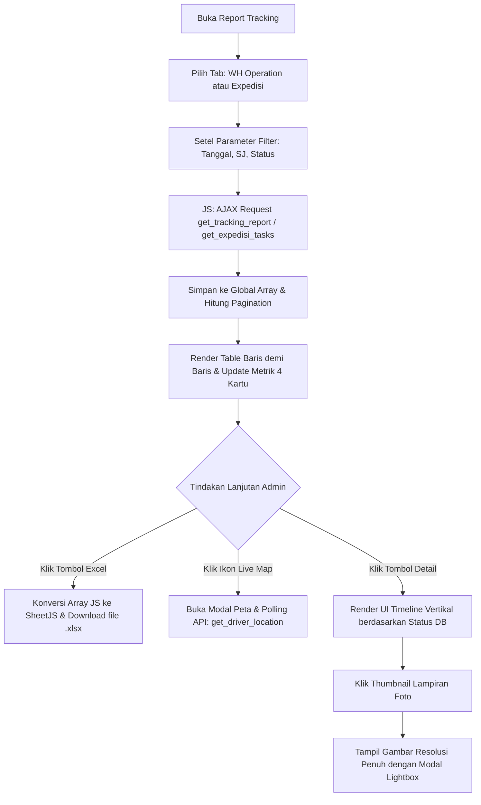

# Dokumentasi: `report_tracking.php`

## Deskripsi Singkat
File `report_tracking.php` adalah halaman pusat pelaporan (*monitoring dashboard*) untuk melacak status akhir maupun riwayat seluruh pengiriman, baik yang dilakukan oleh Driver Internal Gudang (*WH Operation*) maupun layanan pihak ketiga (*Expedisi*). Halaman ini merupakan fitur paling penting bagi Admin untuk melakukan pelacakan GPS, mengekspor laporan akhir bulanan/harian ke Excel, serta melihat rekam jejak (*timeline*) sebuah Nomor Surat Jalan (SJ) layaknya melihat resi di *e-commerce*.

## Fitur Utama
1. **Dua Mode Pelaporan (Tabs):** Pemisahan data untuk pengiriman Internal (Tab WH Operation) dan pengiriman Eksternal (Tab Expedisi).
2. **Dashboard Statistik (4 Kartu):** Menampilkan metrik real-time di bagian atas: Total Surat Jalan, Belum Berangkat (*Pending*), Dalam Perjalanan (*Transit*), dan Selesai Diterima.
3. **Filter Laporan Lanjutan:** Mendukung filter ganda berupa rentang tanggal (*Date From - Date To*), pencarian teks bebas pada Nomor Surat Jalan, saringan Status Pengiriman, serta *dropdown* khusus Vendor (pada tab Expedisi).
4. **Tabel Data Cepat dengan Paginasi (*Pagination*):** Tabel dirender oleh JavaScript yang menangani pengurutan baris dan pergantian halaman tanpa memuat (*load*) ulang database secara berlebihan, membuat pengalaman filter jauh lebih cepat.
5. **Ekspor Data Excel (XLSX):** Menggunakan *library SheetJS* untuk mengubah format array JSON dari tabel yang sedang dilihat langsung ke file *.xlsx* Microsoft Excel yang bersih dan terstruktur.
6. **Live Map Tracking:** Khusus untuk driver internal, jika tugas dalam perjalanan (Transit), Admin dapat menekan ikon Map untuk membuka Peta (menggunakan *library Leaflet.js*) guna melihat posisi koordinat lintang-bujur (*latitude-longitude*) terbaru driver.
7. **Visualisasi Rute (Shopee-Style Timeline):** Mengklik tombol 'Detail' pada baris tabel akan membuka jendela pelacakan berorientasi vertikal. Elemen ini menunjukkan:
   - Cap waktu saat ditugaskan
   - Cap waktu mulai berangkat
   - Cap waktu kedatangan
   - Nama penerima & alasan terlambat (jika ada)
   - Galeri *thumbnail* **Bukti Foto** (*Proof of Delivery*) yang dapat diklik membesar (fitur *Lightbox*).

## Alur Interaksi Laporan

## API Endpoint yang Terhubung
- **`?action=get_tracking_report` & `?action=get_expedisi_tasks`**: Endpoint besar yang mengambil semua kolom data yang dibutuhkan (termasuk *join* ke nama lokasi, driver, dan parsing JSON *attachment files*) dengan filter dasar berupa batasan rentang tanggal.
- **`?action=get_expedisi_vendors`**: Mengisi daftar *dropdown* filter opsi Vendor pada tab Expedisi.
- **`?action=get_driver_location`**: Dipanggil secara periodik (*polling* interval) saat *Live Map Modal* dibuka untuk mengambil titik lokasi terbaru yang dipancarkan oleh ponsel pengemudi.
