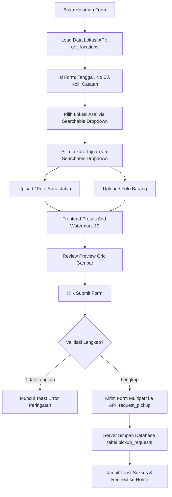

# Dokumentasi: `request_pickup_form.php`

## Deskripsi Singkat
File `request_pickup_form.php` adalah formulir berbasis web (dioptimalkan untuk mobile/tablet) yang ditujukan untuk Pengguna (biasanya pihak Toko/Store atau pembuat permintaan / *Requester*). Fungsi utamanya adalah membuat permohonan penjemputan barang (Request Pickup). Formulir ini menuntut input detail barang serta kewajiban melampirkan foto Surat Jalan dan Kondisi Barang.

## Fitur Utama
1. **Input Detail Pengiriman:** Pengguna wajib memasukkan Rencana Tanggal Penjemputan, Nomor Surat Jalan, dan Total Koli barang yang akan dipickup.
2. **Pencarian Lokasi Cepat (*Searchable Dropdown*):** Field Lokasi Asal dan Lokasi Tujuan menggunakan dropdown pintar (*custom searchable select*). Pengguna dapat mengetik nama toko atau tujuan dan opsi yang relevan akan langsung terfilter, meminimalisir kesalahan pengetikan nama lokasi.
3. **Pengambilan Foto dengan Auto-Watermark:** Pengguna wajib menjepret / mengunggah dua jenis foto: **Foto Surat Jalan** dan **Foto Barang/Koli**. Sama seperti di aplikasi driver, *frontend* akan memproses foto-foto tersebut via Canvas JS untuk disisipkan **Watermark** secara otomatis. Watermark tersebut berisi:
   - Nomor SJ
   - Lokasi Asal
   - Lokasi Tujuan
   - User Pembuat
   - Waktu (Timestamp) Pembuatan
4. **Validasi Keras (*Strict Validation*):** *Submit* form tidak akan diteruskan ke server sebelum pengguna mengisi secara valid Dropdown Lokasi dan minimal satu lembar foto untuk SJ dan Barang.
5. **Processing Overlay:** Karena *client-side processing* untuk menambahkan watermark ke gambar beresolusi tinggi butuh waktu, aplikasi menyediakan *Loading Overlay* transparan agar layar tidak terasa membeku.

## Alur Pembuatan Request Pickup

## API Endpoint yang Terhubung
- **`GET api.php?action=get_locations`**: Digunakan saat pertama halaman dimuat (onload) untuk menarik daftar master lokasi dari *database*. Data JSON lokasi ini dirender ke dalam *Custom Select Dropdown*.
- **`POST api.php?action=request_pickup`**: Endpoint inti yang akan menerima *Payload* dari form (data teks dan file gambar majemuk dari *array* `surat_jalan_files[]` dan `goods_files[]`). Di *backend*, gambar akan disimpan dan baris data akan disisipkan ke tabel `pickup_requests` dengan status `Pending`.
